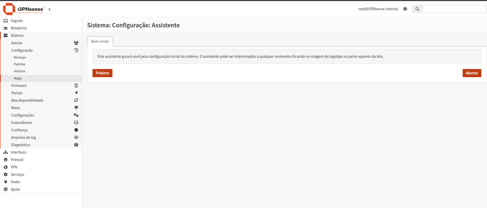

# 🔥 Firewall

O curso que estou utilizando usa o **pfSense**, mas utilizarei o **OPNsense** pelo seguinte motivo: quero uma **imagem oficial, segura e sem precisar realizar cadastro em nenhum local**.
Dito isso, **as duas distribuições são muito parecidas**.

---

## 🌐 OPNsense

Site oficial para download:

[https://opnsense.org/get-started/](https://opnsense.org/get-started/)

---

# 💻 Hardware utilizado

* **Processador:** Pentium 4 CPU 3.00GHz
* **Placa-mãe:** Itautec ST 4150
* **Memória:** DDR2 4GB *(não suporta mais que isso)*
* **Armazenamento:** SSD SATA 128GB

---

# 📥 Download da ISO

Realize o download da **imagem ISO** conforme a configuração de hardware disponível.

Depois disso, crie um **pendrive bootável** com a ISO.
Você pode utilizar o software:

* **balenaEtcher**

Esse software permite gravar a ISO no pendrive de forma simples.

---

# ⚙️ Preparando a instalação

Com o pendrive pronto, iniciaremos o processo de instalação.

Primeiro precisamos **acessar a BIOS do computador**.

Normalmente isso é feito pressionando:

* **DEL**
* **F2**

Caso não funcione, procure no Google qual é o botão correto para sua placa-mãe.

Após acessar a BIOS *(aquela tela azul para quem nunca entrou antes 😅)*:

1. Vá até as configurações de **BOOT**
2. Altere a **ordem de inicialização**
3. Coloque o **pendrive como primeiro dispositivo**

Depois disso:

* **Salve as configurações**
* **Saia da BIOS**

---

# 🚀 Iniciando o sistema

A máquina irá reiniciar e provavelmente iniciará pelo pendrive.

Aguarde o sistema carregar. No primeiro acesso teremos um **modo Live**, onde devemos realizar o login utilizando as **credenciais padrão do sistema**.

### Credenciais padrão do OPNsense

Usuário:

```
root
```

Senha:

```
opnsense
```

⚠️ **Observação:** essa senha deverá ser alterada posteriormente.

---

# 🔌 Configuração das interfaces

Após o login, teremos acesso ao **menu do sistema**, que possui cerca de **12 opções**.

A primeira coisa que devemos verificar é se o sistema conseguiu **identificar as interfaces de rede**.

Caso não tenha identificado, acesse:

```
Opção 1
```

Nessa opção realizaremos a configuração das interfaces:

* **LAN**
* **WAN**

Uma dica importante é **verificar o MAC Address** de pelo menos uma interface para facilitar na identificação.

No meu caso:

* A interface **LAN** tinha o MAC iniciando com **00:1A**

Após identificar as interfaces corretamente, finalize a configuração.

---

# 🌍 Acesso ao Firewall

Depois da configuração das interfaces podemos acessar o firewall via:

### Interface Web

```
192.168.1.1
```

### Acesso SSH

```
root@192.168.1.1
```

No meu caso utilizei a **interface web**, onde realizaremos o restante das configurações.



---

# ⚠️ Observação importante

Ainda durante a etapa de instalação, realize a configuração de **WAN e LAN** e verifique com sua **operadora de internet** qual é o **tipo de conexão utilizado**, por exemplo:

* **PPPoE**
* **PPP**
* **DHCP**

Realize essa configuração **antes de alterar o roteador para modo bridge**, pois quando o roteador estiver em **bridge**, o responsável por gerenciar os **endereços IP será o firewall**.

